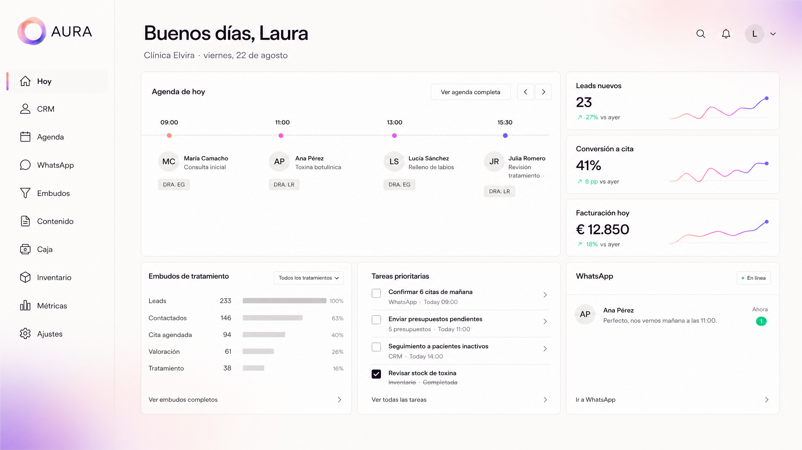
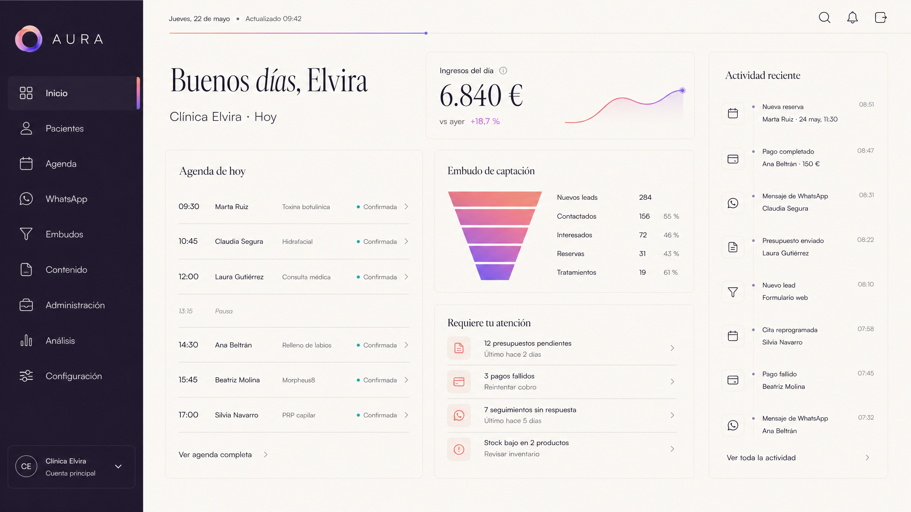
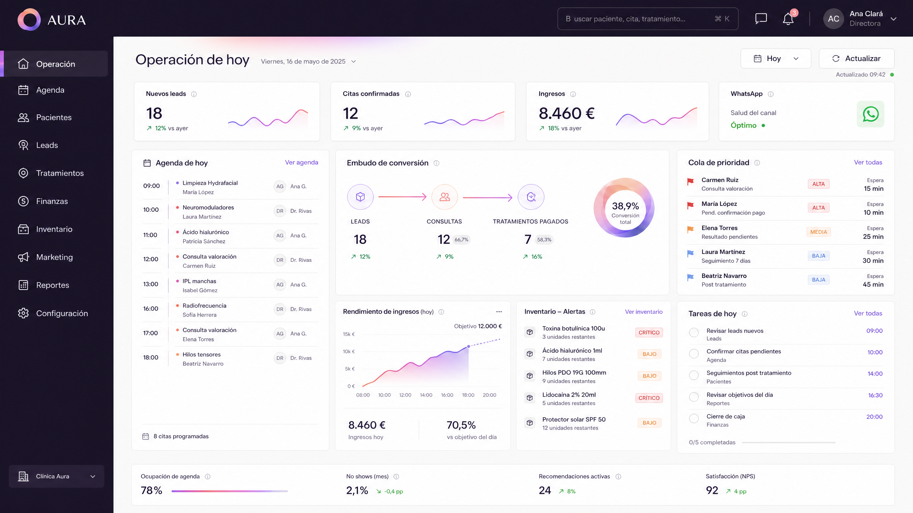

# Comparativa de conceptos visuales del dashboard de AURA

## Criterio de evaluación

Las tres propuestas respetan la misma arquitectura funcional. Cambian únicamente la expresión visual. Ninguna debe aplicarse directamente a producción: primero se elige una dirección y después se traduce a tokens, componentes, iconos y pruebas responsive.

| Concepto | Identidad propia | Uso diario | Efecto wow | Riesgo de aspecto IA | Escalabilidad |
|---|---:|---:|---:|---:|---:|
| **A · Pearl Aurora** | 9/10 | 9/10 | 8/10 | Bajo | 10/10 |
| **B · Editorial Clinic** | 10/10 | 8/10 | 9/10 | Bajo | 8/10 |
| **C · Luminous Operations** | 8/10 | 10/10 | 9/10 | Medio si se exagera | 9/10 |

## A · Pearl Aurora

La propuesta más equilibrada. Utiliza el degradado como atmósfera y firma de navegación, conserva superficies neutras y permite que Agenda, WhatsApp, CRM y Caja compartan el mismo lenguaje sin que cada módulo parezca una aplicación distinta.

## B · Editorial Clinic

La propuesta con mayor personalidad de marca. Funciona especialmente bien para propietarios, métricas y presentación comercial. Requiere disciplina al llevarla a tablas densas y a la agenda para que la parte editorial no reduzca velocidad operativa.

## C · Luminous Operations

La propuesta más potente para operación diaria. Muestra más información y transmite sistema operativo. Es la que más debe vigilarse para que la luz gradual no se convierta en un recurso repetido o en la estética morada típica de dashboards generados.

## Recomendación

La dirección recomendada es **A · Pearl Aurora como sistema base**, incorporando dos decisiones de las otras propuestas: el sidebar ciruela de B como variante opcional para navegación extensa y la densidad de información de C para Agenda, Caja y Métricas.

Esta combinación mantiene una identidad reconocible sin sacrificar usabilidad. La ejecución debería comenzar por un pequeño sistema de diseño AURA, no por un cambio masivo del archivo: tokens de color, tipografía Instrument Sans, subconjunto Iconoir, botones, inputs, tablas, navegación, estados y gráficos. Después se migrarían tres pantallas piloto —Inicio, Agenda y Comunicaciones— antes del resto del CRM.

## Decisiones que deben aprobarse antes de desarrollar

| Decisión | Recomendación |
|---|---|
| Base visual | Pearl Aurora |
| Navegación | Clara por defecto; ciruela para modo de alta densidad si la prueba lo justifica |
| Tipografía de interfaz | Instrument Sans |
| Tipografía editorial | Ninguna en la primera iteración; evaluar después de Agenda y CRM |
| Iconos | Iconoir con subconjunto y reglas AURA |
| Emojis | Retirarlos de navegación, botones, estados y métricas; conservarlos solo en contenido escrito por pacientes si procede |
| Degradado | Ambiente, selección, acción primaria y datos clave; nunca un color diferente por módulo |
| Migración | Inicio → Agenda → Comunicaciones → CRM → resto del panel |
